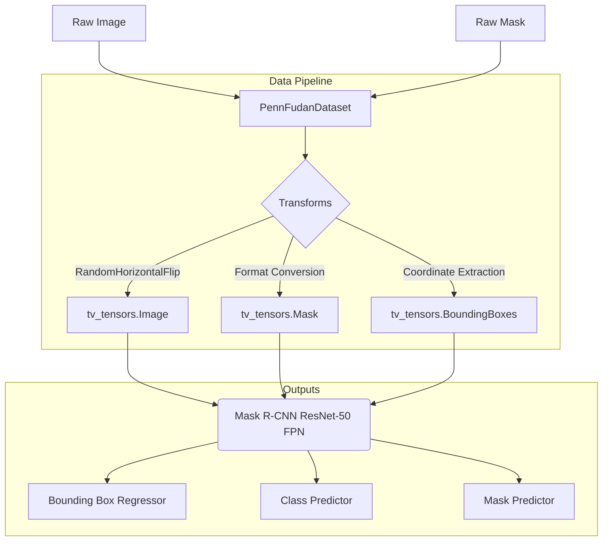
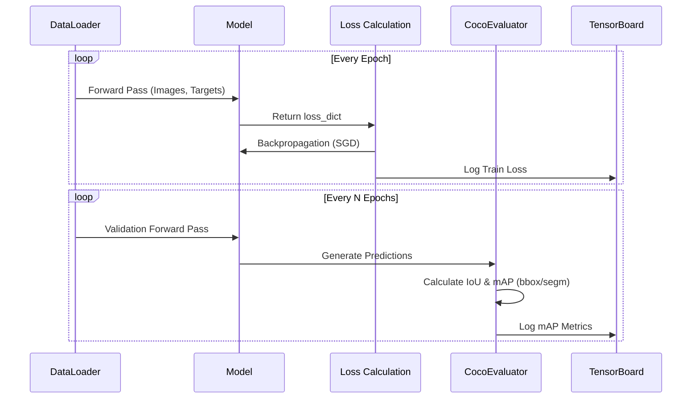

# MaskRCNN-Pedestrian-Detection-and-Segmentation
Pedestrian detection and segmentation using Mask R-CNN on the Penn-Fudan dataset.

[](https://colab.research.google.com/github/MdA-Saad/MaskRCNN-Pedestrian-Detection-and-Segmentation/blob/main/pedestriansDetection.ipynb)
[PennFudanPed](https://www.cis.upenn.edu/~jshi/ped_html/) dataset for pedestrian detection and instance segmentation.

Here is a deep-dive technical overview of the theoretical concepts powering this project. You can add this directly to your project documentation, `README.md`, or personal notes to solidify the underlying computer vision and deep learning concepts.

---

## 📚 Core Theoretical Framework

To understand Mask R-CNN, it helps to place it along the evolution of computer vision tasks. While basic **Object Detection** predicts bounding boxes $(x, y, w, h)$ and class labels, and **Semantic Segmentation** labels every pixel in an image by class without distinguishing individual objects, **Instance Segmentation** combines both. It detects every individual object of interest and delineates a precise, pixel-level binary mask for each single instance.

```
+---------------------+---------------------------------------------------------+
| Task                | Output Goal                                             |
+---------------------+---------------------------------------------------------+
| Object Detection    | Draws bounding boxes around objects                     |
| Semantic            | Classifies pixels (e.g., all "person" pixels grouped)   |
| Instance            | Classifies pixels AND separates individual instances    |
+---------------------+---------------------------------------------------------+

```

---

## 1. The Architectural Evolution to Mask R-CNN

Mask R-CNN is the culmination of a multi-year evolution in region-based convolutional neural networks.

### R-CNN (2014)

R-CNN used an external algorithm called *Selective Search* to propose roughly 2,000 regions of interest per image. Each region was cropped, warped to a fixed size, and passed through a CNN independently.

* **The Bottleneck:** Running 2,000 forward passes of a CNN for a single image made inference impractically slow (tens of seconds per image).

### Fast R-CNN (2015)

Fast R-CNN solved the speed bottleneck by running the full image through the CNN *first* to extract a shared feature map. Selective search proposals were then projected directly onto this feature map, and a layer called **RoIPool** extracted fixed-size features for each proposal.

* **The Bottleneck:** While feature extraction became fast, generating region proposals via Selective Search remained an expensive CPU operation.

### Faster R-CNN (2015)

Faster R-CNN replaced Selective Search with a trainable, fully convolutional module called the **Region Proposal Network (RPN)**. The RPN slides over the shared feature map and evaluates predefined candidate boxes called **Anchors** (of varying scales and aspect ratios) to predict candidate region proposals. This made the entire detection framework end-to-end trainable.

### Mask R-CNN (2017)

Mask R-CNN extends Faster R-CNN by adding a **small parallel branch** that outputs binary masks for each detected object. Alongside predicting class labels and refining bounding boxes, it outputs a $m \times m$ pixel mask for each candidate region.

---

## 2. Key Architectural Components

### Backbone Network: ResNet & Residual Learning

Standard deep networks often suffer from the *degradation problem*: as network depth increases, accuracy saturates and then degrades rapidly because gradients vanish during backpropagation.

ResNet (Residual Network) solves this by introducing **Residual Blocks** with shortcut (skip) connections. Instead of forcing stacked layers to directly fit an underlying mapping $H(x)$, ResNet forces them to fit a residual mapping $F(x) = H(x) - x$. The original input $x$ is added back directly:

$$y = F(x) + x$$

* **Practical Example:** If an intermediate layer learns nothing useful, the weights $F(x)$ can decay to zero, leaving $y = x$. This acts as an identity shortcut, allowing gradients to flow unimpeded through hundreds of layers.

---

### Feature Pyramid Network (FPN)

Detecting pedestrians of vastly different sizes (e.g., a person near the camera vs. a distant pedestrian on the horizon) is inherently challenging for standard CNNs. Early convolutional layers preserve high spatial resolution (great for small objects) but lack deep semantic information. Deeper layers capture rich semantic context but lose spatial resolution due to downsampling operations.

FPN addresses this by constructing a pyramid of multi-scale feature maps:

1. **Bottom-up Pathway:** A standard feature extractor (like ResNet) computes a hierarchy of feature maps at decreasing spatial resolutions.
2. **Top-down Pathway:** Higher-level features with rich semantic information are upsampled to match the higher spatial dimensions of lower layers.
3. **Lateral Connections:** High-resolution features from the bottom-up path are added directly to the upsampled features from the top-down path via $1 \times 1$ convolutions.

As a result, the RPN can detect small pedestrians using early, high-resolution feature maps and large pedestrians using deeper, semantically rich feature maps.

---

### RoIAlign: Fixing the Spatial Misalignment

In Faster R-CNN, candidate regions of interest (RoIs) were cropped using **RoIPool**. RoIPool performs integer quantization (rounding coordinates) to map floating-point region proposals onto the discrete grid of the feature map.

* **The Problem with RoIPool:** Suppose a feature map is downsampled by a factor of 16 relative to the original image. A region proposal with a coordinate like $x = 15$ pixels gets quantized to $\lfloor 15 / 16 \rfloor = 0$. While a offset of a few pixels causes negligible error for coarse bounding box detection, it causes significant spatial misalignment when trying to draw crisp, pixel-accurate segmentation masks.
* **The RoIAlign Solution:** RoIAlign eliminates spatial quantization entirely. Instead of rounding fractional coordinates, it preserves exact floating-point values and computes exact feature values at continuous points using **Bilinear Interpolation**.

$$\text{Value}(x, y) = \sum_{i,j} w_{ij} \cdot I(x_i, y_j)$$

By evaluating features at four regularly sampled points within each RoI bin and averaging the results, RoIAlign maintains exact spatial alignment from input pixels to predicted mask pixels.

---

## 3. Multi-Task Loss Formulation

During training, Mask R-CNN optimizes a multi-task loss function defined on each candidate RoI:

$$\mathcal{L} = \mathcal{L}_{\text{cls}} + \mathcal{L}_{\text{box}} + \mathcal{L}_{\text{mask}}$$

1. **Classification Loss ($\mathcal{L}_{\text{cls}}$):** Standard categorical cross-entropy loss evaluating how accurately the model classifies the detected object (e.g., background vs. pedestrian).
2. **Bounding Box Loss ($\mathcal{L}_{\text{box}}$):** Smooth $L_1$ loss evaluating the distance between predicted bounding box offsets $(t_x, t_y, t_w, t_h)$ and ground-truth targets.
3. **Mask Loss ($\mathcal{L}_{\text{mask}}$):** Average binary cross-entropy loss applied to an $m \times m$ mask output.

* **Class-Decoupled Mask Generation:** For an RoI associated with ground-truth class $k$, $\mathcal{L}_{\text{mask}}$ is defined **only** on the $k$-th mask output. This prevents cross-class competition (e.g., the mask branch does not have to decide between pedestrian or bicycle—it simply generates a dedicated binary mask assuming the candidate is a pedestrian).

---

## 4. Evaluation Metrics: COCO Mean Average Precision (mAP)

Evaluating detection and segmentation models relies on comparing predicted outputs against ground-truth labels using **Intersection over Union (IoU)**:

$$\text{IoU} = \frac{\text{Area of Overlap}}{\text{Area of Union}}$$

```
       Predicted Box / Mask
         +---------------+
         |               |
         |     +---------+-----+
         |     | OVERLAP |     |
         +-----+---------+     |
               |               |
               +---------------+
               Ground Truth Box / Mask

```

### Understanding Precision vs. Recall

* **Precision:** Of all the detections the model predicted, what percentage was actually correct?
* **Recall:** Of all the real pedestrians present in the images, what percentage did the model successfully find?

### The COCO Standard

Rather than evaluating precision and recall at a single arbitrary threshold, COCO evaluation measures **mAP@[.50:.95]**.

This computes average precision across **10 distinct IoU thresholds** ranging from $0.50$ to $0.95$ in increments of $0.05$ (i.e., $0.50, 0.55, 0.60, \dots, 0.95$).

* Lower thresholds ($0.50$) evaluate coarse detection capability.
* Higher thresholds ($0.85+$) heavily penalize loose masks or poorly aligned bounding boxes, rewarding precise spatial localization.


Here is a complete, professional `README.md` for your project. It includes Mermaid diagrams to visually map out your data pipeline and training loop, making it immediately clear to anyone viewing your repository how the architecture functions.

I have structured the setup instructions to utilize the `uv` package manager for fast, isolated environment syncing, and included a section on how this 2D segmentation fits into broader multi-view applications.

You can copy this block exactly as it is and commit it to your GitHub repository.

---

```markdown
# Pedestrian Instance Segmentation with Mask R-CNN

A robust PyTorch implementation of Mask R-CNN for pedestrian detection and instance segmentation, trained on the Penn-Fudan Database. This project leverages the modern `torchvision.tv_tensors` API to handle complex data augmentations and bounding box transformations natively.

## 🚀 Overview

This repository provides a complete pipeline for training, evaluating, and visualizing a Mask R-CNN model (ResNet-50-FPN backbone). It includes a custom COCO evaluation integration to calculate industry-standard Mean Average Precision (mAP) for both bounding boxes and segmentation masks.

### Architecture & Pipeline



## 🛠️ Installation & Setup

To manage project dependencies quickly and ensure strict environment isolation, it is recommended to use the `uv` package manager.

**1. Clone the repository:**

```bash
git clone [https://github.com/yourusername/pedestrian-detection-maskrcnn.git](https://github.com/yourusername/pedestrian-detection-maskrcnn.git)
cd pedestrian-detection-maskrcnn

```

**2. Initialize the environment and install dependencies:**

```bash
# Create a virtual environment
uv venv

# Activate the environment
source .venv/bin/activate

# Install required packages
uv pip install torch torchvision pycocotools matplotlib numpy tqdm tensorboard

```

## 🧠 Training Workflow

The training loop features automated early stopping, learning rate scheduling, and real-time TensorBoard logging for loss metrics and COCO evaluation scores.



**To start training:**
Ensure the Penn-Fudan dataset is downloaded and extracted to the `data/` directory, then run:

```bash
python copy_of_pedestriansdetection.py

```

Checkpoints will be saved automatically to your configured output directory as `best_maskrcnn_pennfudan.pth`.

## 🔍 Inference & Visualization

The repository includes a dedicated inference function that safely decouples the saved model weights from the training loop, moving output tensors to the CPU for visualization.

To run inference on a custom image or a validation sample:

```python
from your_script import run_inference

# Define the path to your trained weights
weights_path = "./outputs/best_maskrcnn_pennfudan.pth"

# Run inference and visualize (Confidence threshold defaults to 0.7)
run_inference(model_weights_path=weights_path, image_index=10, conf_threshold=0.75)

```

## 🌐 Future Applications

The highly accurate binary masks generated by this model are designed to act as a robust preprocessing layer. By isolating pedestrians, these masks can be utilized to filter out dynamic objects prior to running feature matching (e.g., ORB) and multi-view 3D camera calibration algorithms, significantly reducing noise in structure-from-motion (SfM) pipelines.

```

```


## Highlights
- **71.3% mAP@[0.5:0.95]** for bounding box detection  
- **69.0% mAP@[0.5:0.95]** for instance segmentation  
- Full COCO-compatible evaluation using `pycocotools`  
- Custom dataset class with mask-to-bbox conversion and size metadata  
- Visualization of predictions with `torchvision.utils.draw_bounding_boxes` and `draw_segmentation_masks`

## Tech Stack
PyTorch • TorchVision • COCO API • NumPy • Matplotlib
